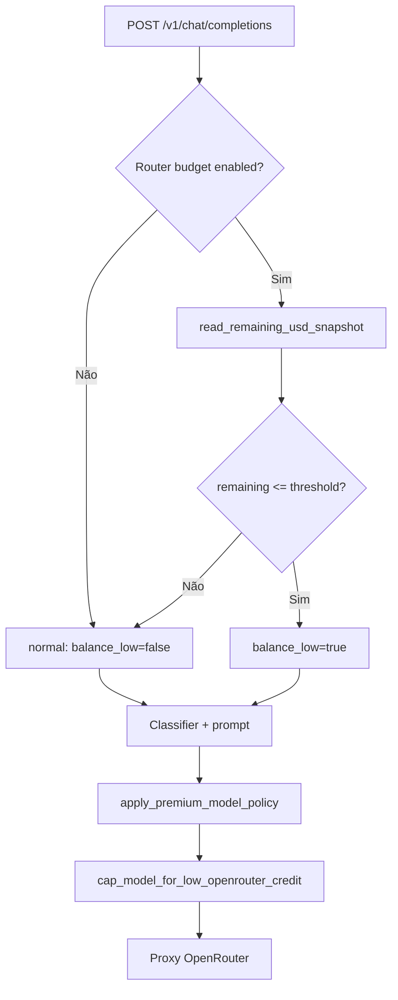

# Router em modo económico — documentação técnica

## Objectivo

Quando o saldo OpenRouter (USD) gravado na base de dados está **igual ou abaixo** de um limiar configurável, o gateway:

1. **Escolhe localmente** o `model_id` por heurísticas rápidas. Se `ROUTER_DECISION_MODE=llm`, o caminho antigo com classificador Ollama continua disponível.
2. **Aplica um teto determinístico**: se o classificador ainda devolver um modelo das categorias **complex** ou **frontier** (definidas em `src/router/models_config.yaml`), o `model_id` efectivo é forçado para **`moonshotai/kimi-k2.5`** (tier reasoning+).

Isto complementa a política de **modelo premium** (`apply_premium_model_policy`), que trata o modelo premium só para `X-User-Id` na allowlist. O teto de crédito baixo pode ainda reduzir esse modelo → Kimi mesmo para utilizadores na allowlist (prioridade: poupança quando o snapshot indica saldo crítico).

---

## Dados de entrada (saldo)

- **Fonte:** tabela PostgreSQL `openrouter_credits_state` (migração `migrations/005_openrouter_credits_state.sql`), linha `id = 1`, campo `remaining_usd`.
- **Função:** `read_remaining_usd_snapshot()` em `src/usage/openrouter_credits_state.py` — **apenas leitura SQL**, sem HTTP ao OpenRouter no caminho do chat.
- **Actualização do snapshot:** endpoint `GET /usage/openrouter/credits` (admin, Auth0), que chama a API OpenRouter uma vez e faz `UPSERT` na tabela.

**Implicação:** o modo económico do router reage ao **último valor persistido**. Se o snapshot estiver desactualizado, o comportamento pode ficar desalinhado do saldo real até o próximo refresh administrativo.

---

## Configuração (`Settings` / `.env`)

| Variável | Papel |
|----------|--------|
| `OPENROUTER_ROUTER_BUDGET_ENABLED` | `false` desliga por completo o modo (sem bloco extra no classificador nem teto de modelo). Default no código: `true`. |
| `OPENROUTER_ROUTER_BUDGET_THRESHOLD_USD` | Limiar **só** para o router. Se **omitido** (`None`), usa-se `OPENROUTER_CREDITS_ALERT_THRESHOLD_USD`. |
| `OPENROUTER_CREDITS_ALERT_THRESHOLD_USD` | Usado para `show_alert` no endpoint de créditos e, na ausência do threshold do router, como limiar do modo económico. |

Exemplo típico de negócio: alerta de UI a **10 USD**, router a começar a poupar a **25 USD** (`OPENROUTER_ROUTER_BUDGET_THRESHOLD_USD=25`).

---

## Fluxo no request (`src/gateway/proxy.py`)

Ordem relevante no primeiro POST de um turno (quando ainda não existe `model_id` no acumulador):

1. Calcular `budget_thr` (router threshold ou fallback para o do alerta).
2. Se `openrouter_router_budget_enabled`: `snap_remaining = await read_remaining_usd_snapshot()`; `openrouter_balance_low = snap_remaining is not None and snap_remaining <= budget_thr`.
3. `router_route(user_message, openrouter_balance_low=openrouter_balance_low)` → decisão local por defeito; em modo LLM, classificador com ou sem o bloco `LOW_OPENROUTER_BALANCE_BLOCK` em `src/router/classifier_prompt.py`.
4. `apply_premium_model_policy(settings, ctx, model_id)`.
5. `cap_model_for_low_openrouter_credit(model_id, balance_low=openrouter_balance_low)` em `src/gateway/model_policy.py`.

Em **cada** POST ao mesmo turno (incluindo chamadas subsequentes):

- Repete-se a leitura do snapshot e o `openrouter_balance_low`.
- Volta a aplicar-se `apply_premium_model_policy` e `cap_model_for_low_openrouter_credit`; se o modelo mudar, actualiza-se o balde via `set_bucket_model_id`.

---

## Classificador (Ollama)

- **Modo normal:** heurístico local, sem chamada externa.
- **Modo LLM:** `CLASSIFIER_SYSTEM_PROMPT` + `CLASSIFIER_USER_PROMPT`, construídos por `build_classifier_prompt()` em `src/router/classifier_prompt.py`.
- **Modo baixo saldo:** com `openrouter_balance_low=True`, concatena-se `LOW_OPENROUTER_BALANCE_BLOCK` ao *system* (inglês), com regras explícitas: preferir o modelo default do tier *reasoning* (`qwen/qwen3.5-397b-a17b`), reservar `moonshotai/kimi-k2.5` (reasoning+) quando necessário, restringir GPT‑5.4 Mini exceto pedido explícito do utilizador.

O classificador continua a devolver JSON `{"model": "..."}`; o *parsing* e fallbacks mantêm-se em `src/router/router.py` (`route`, `_call_classifier`, `_parse_model_from_response`).

---

## Teto por *tier* (`models_config.yaml`)

`get_model_info(model_id)` expõe o campo `tier` por modelo. Com `balance_low=True`:

- `tier in ("complex", "frontier")` → substituição por `moonshotai/kimi-k2.5`.
- `reasoning` / `reasoning+` → sem alteração por este teto.

Mapeamento de IDs e *tiers* está em `src/router/models_config.yaml`.

---

## Diagrama (visão simplificada)

---

## Operação e observabilidade

- Log informativo quando entra modo económico: `[Router] Modo económico OpenRouter (remaining_usd=... <= ...)` em `src/gateway/proxy.py`.
- Para testes unitários do teto e do prompt: `test/test_low_credit_router.py`.

---

## Limitações conhecidas

- Depende do **snapshot** na BD, não de uma consulta em tempo real ao OpenRouter por mensagem.
- O router é heurístico por defeito; o **teto** garante um limite máximo de custo por *tier* (complex/frontier → Kimi) quando o modo está activo.
- `DATABASE_URL` no gateway usa `postgresql+asyncpg://` na app; o *pool* asyncpg partilha a mesma origem que `read_remaining_usd_snapshot`.
